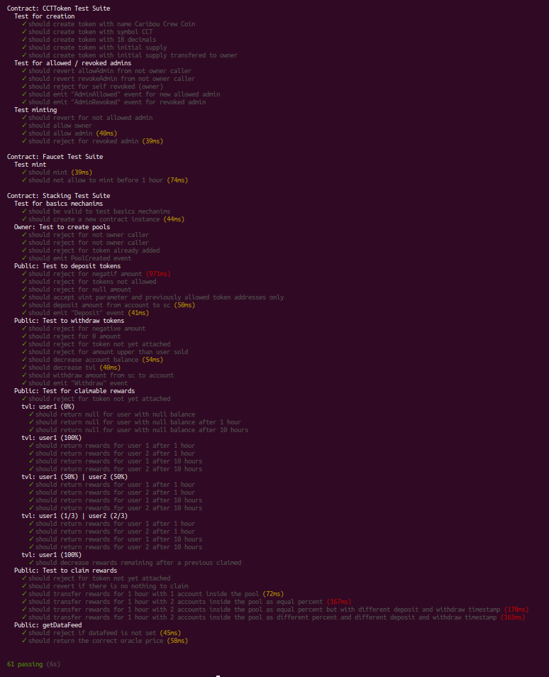

# Projet 3

# Alyra - Project 4 - Stacking

## Table of contents

- [TOC](#Table-of-contents)
- [Subject](#Subject)
    - [Your DApp must allow](#Your-DApp-must-allow)
    - [Recommendations and requirements](#Recommendations-and-requirements)
- [Rendered](#Rendered)
- [Tests result](#Tests-result)
- [Team](#Team)

---

---

## Subject

Create a DApp that allows stacking !
 > **What's Stacking?**
 >
 > Staking consists of blocking an X quantity of cryptocurrencies in a smart contract or a wallet in order to assist the network. For this action, the holder of the staked cryptocurrencies is rewarded in the form of tokens, a reward that can be likened to crypto-dividends or interest.

> **Quel est l'intérêt de faire du Staking ?**
> 
> Staking allows an investor to earn interest or dividends rather than letting their cryptocurrencies “sleep” without generating profits.
>
> To put this concept into practice you will need to build a Dapp that allows users to stake (immobilize) any ERC20 token and automate the issuance of rewards to stakers (liquidity providers) in the form of tokens.
>
> The token reward received by users is a very important part of your Dapp. It must be proportional to the amount of funds blocked on the smart contract. To do this, you need the current market value of the locked asset, which you can retrieve using Chainlink's oracle.
>
> Obtaining price data from Chainlink gives you a way to compare the value of tokens locked on the smart contract. You can easily convert the value of any ERC20 token to its ETH value to calculate and determine the exact reward value.

### **Your DApp must allow:**

- [x] Stake your ERC20 token
- [x] Unstake his tokens
- [x] Create your own reward token or use ETH or another ERC20 token (Dai for example)
- [x] The amount of the reward must be proportional to the value locked on the smart contract

### **Recommendations and requirements:**

- [x] Using the Chainlink Oracle
- [x] The protocol should allow any staked crypto to be translated into a "main" unit(USDC, ETH, whatever).
- [x] The rewards are made in token of the protocol (created therefore), and they are based on the value locked in the protocol by a user on a token on ( / ) the complete value locked on this token

## **Rendered**

Contract address on kovan: ****

- [Link to your Github repository](https://github.com/Jiwoks/AlyraStacking)
- [Link to dApp in test network](https://jiwoks.github.io/AlyraStacking/)
- [Video Front](https://www.loom.com/share/cc26c41da6c44bf4ab79e3a88adbcf16)
- [Video Front]()
- [Video SmartContracts]()
- [Video Organization](https://www.loom.com/share/1ffe5aa745b0472390e2526b0acba9df)
- [Notion Organization](https://tonted.notion.site/DeFi-Stacking-144e7e2465d8439f9cf62845f590a527)

## **Various explanations**

### Using chainlink:
We used the chainlink oracle to have the conversion of tokens into USD ([dataFeeds](https://docs.chain.link/docs/ethereum-addresses/)).<br>
Although this could be done directly in the front we implemented a function in the smart contract to retrieve this information.<br>
We therefore use the aggregator proposed by chainlink [AggregatorV3Interface.sol](https://github.com/smartcontractkit/chainlink/blob/develop/contracts/src/v0.8/interfaces/AggregatorV3Interface.sol)

  ```javascript
...
import "@chainlink/contracts/src/v0.8/interfaces/AggregatorV3Interface.sol";
...

function getDataFeed(IERC20 _token)
    external
    view
    returns (int256 price, uint256 decimals)
    {
        address atOracle = pools[_token].oracle;
        require(atOracle != address(0), "DataFeed not available");
    
        AggregatorV3Interface priceFeed = AggregatorV3Interface(atOracle);
        (
            /*uint80 roundID*/,
            int256 aggregatorPrice,
            /*uint startedAt*/,
            /*uint timeStamp*/,
            /*uint80 answeredInRound*/
        ) = priceFeed.latestRoundData();
        return (aggregatorPrice, pools[_token].decimalOracle);
    }
  ```
*As a reminder, our pool structure contains a variable with the address of the linked oracle during the creation of the pool.<br>
**This arguments is obligatory***

## Tests result

```
Contract: CCTToken Test Suite
Test for creation
    ✓ should create token with name Caribou Crew Coin
    ✓ should create token with symbol CCT
    ✓ should create token with 18 decimals
    ✓ should create token with initial supply
    ✓ should create token with initial supply transfered to owner
Test for allowed / revoked admins
    ✓ should revert allowAdmin from not owner caller
    ✓ should revert revokeAdmin from not owner caller
    ✓ should reject for self revoked (owner)
    ✓ should emit "AdminAllowed" event for new allowed admin
    ✓ should emit "AdminRevoked" event for revoked admin
Test minting
    ✓ should revert for not allowed admin
    ✓ should allow owner
    ✓ should allow admin (40ms)
    ✓ should reject for revoked admin (39ms)

Contract: Faucet Test Suite
Test mint
    ✓ should mint (39ms)
    ✓ should not allow to mint before 1 hour (74ms)

Contract: Stacking Test Suite
Test for basics mechanims
    ✓ should be valid to test basics mechanims
    ✓ should create a new contract instance (44ms)
Owner: Test to create pools
    ✓ should reject for not owner caller
    ✓ should reject for not owner caller
    ✓ should reject for token already added
    ✓ should emit PoolCreated event
Public: Test to deposit tokens
    ✓ should reject for negatif amount (971ms)
    ✓ should reject for tokens not allowed
    ✓ should reject for null amount
    ✓ should accept uint parameter and previously allowed token addresses only
    ✓ should deposit amount from account to sc (50ms)
    ✓ should emit "Deposit" event (41ms)
Public: Test to withdraw tokens
    ✓ should reject for negative amount
    ✓ should reject for 0 amount
    ✓ should reject for token not yet attached
    ✓ should reject for amount upper than user sold
    ✓ should decrease account balance (54ms)
    ✓ should decrease tvl (40ms)
    ✓ should withdraw amount from sc to account
    ✓ should emit "Withdraw" event
Public: Test for claimable rewards
    ✓ should reject for token not yet attached
tvl: user1 (0%)
    ✓ should return null for user with null balance
    ✓ should return null for user with null balance after 1 hour
    ✓ should return null for user with null balance after 10 hours
tvl: user1 (100%)
    ✓ should return rewards for user 1 after 1 hour
    ✓ should return rewards for user 2 after 1 hour
    ✓ should return rewards for user 1 after 10 hours
    ✓ should return rewards for user 2 after 10 hours
tvl: user1 (50%) | user2 (50%)
    ✓ should return rewards for user 1 after 1 hour
    ✓ should return rewards for user 2 after 1 hour
    ✓ should return rewards for user 1 after 10 hours
    ✓ should return rewards for user 2 after 10 hours
tvl: user1 (1/3) | user2 (2/3)
    ✓ should return rewards for user 1 after 1 hour
    ✓ should return rewards for user 2 after 1 hour
    ✓ should return rewards for user 1 after 10 hours
    ✓ should return rewards for user 2 after 10 hours
tvl: user1 (100%)
    ✓ should decrease rewards remaining after a previous claimed
Public: Test to claim rewards
    ✓ should reject for token not yet attached
    ✓ should revert if there is no nothing to claim
    ✓ should transfer rewards for 1 hour with 1 account inside the pool (72ms)
    ✓ should transfer rewards for 1 hour with 2 accounts inside the pool as equal percent (167ms)
    ✓ should transfer rewards for 1 hour with 2 accounts inside the pool as equal percent but with different deposit and withdraw timestamp (170ms)
    ✓ should transfer rewards for 1 hour with 2 accounts inside the pool as different percent and different deposit and withdraw timestamp (165ms)
Public: getDataFeed
    ✓ should reject if datafeed is not set (45ms)
    ✓ should return the correct oracle price (58ms)
    
---------------|----------|----------|----------|----------|----------------|
File           |  % Stmts | % Branch |  % Funcs |  % Lines |Uncovered Lines |
---------------|----------|----------|----------|----------|----------------|
 contracts/    |      100 |      100 |      100 |      100 |                |
  CCTToken.sol |      100 |      100 |      100 |      100 |                |
  Faucet.sol   |      100 |      100 |      100 |      100 |                |
  Stacking.sol |      100 |      100 |      100 |      100 |                |
---------------|----------|----------|----------|----------|----------------|
All files      |      100 |      100 |      100 |      100 |                |
---------------|----------|----------|----------|----------|----------------|    
```



## Team:
Damien Barrere [github](https://github.com/Jiwoks)
Michael Petit [github](https://github.com/mickpetit)
Teddy Blanco [github](https://github.com/tonTed)